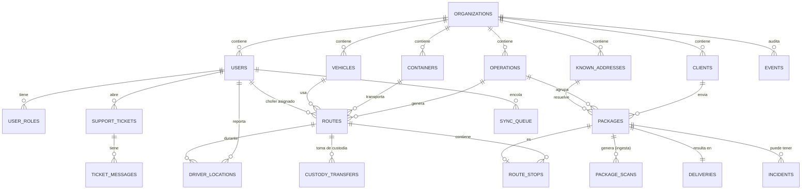

# Modelo de datos — FASE 2

Implementado con Drizzle ORM (`apps/web/src/lib/db/schema/`) y migrado a Postgres/Supabase
vía SQL en `supabase/migrations/`. Ver `docs/DECISIONES.md` (ADR-013 a ADR-017) para el
porqué de cada decisión no obvia.

## Diagrama entidad-relación



_(Diagrama simplificado — no incluye todas las FK, ej. `deliveries.route_id`,
`incidents.route_id`; ver el schema completo en `apps/web/src/lib/db/schema/`.)_

## Convenciones (§7)

- `snake_case` en Postgres, `camelCase` en el schema TypeScript de Drizzle.
- Toda tabla de negocio: `id UUID PK DEFAULT gen_random_uuid()`, `created_at`, `updated_at`,
  y `deleted_at` para soft delete — **excepto `events`**, que no se borra jamás.
- `org_id UUID NOT NULL` en todas las tablas de negocio desde el día 1, salvo dos
  excepciones explícitas del propio documento: `user_roles` (se resuelve el org vía join a
  `users`) y `sync_queue`/`geocode_cache` (sin org, ver ADR correspondiente en el código).
- Enums de Postgres (`pgEnum`) para todo estado — nunca strings libres.
- Índice en toda FK y toda columna de búsqueda frecuente.

## Reglas de diseño no negociables

### `bulk_number` vs `route_stops.sequence`

`packages.bulk_number` es la identidad física del paquete dentro de la ruta — se imprime en
la etiqueta y **nunca cambia** una vez aprobada la ruta (FASE 6). `route_stops.sequence` es
la posición en el orden de entrega — se recalcula todas las veces que haga falta. Nunca
confundirlos: si se imprimiera el número de parada, cualquier reoptimización dejaría todas
las etiquetas mintiendo.

### `events`: append-only real

- Sin `UPDATE`/`DELETE` a nivel Postgres (`REVOKE` + trigger `forbid_events_mutation`, que
  revienta con excepción **sin importar el rol**, incluido el dueño de la tabla).
- El único camino de escritura es `public.log_event(...)`, una función `SECURITY DEFINER`.
- Las correcciones se modelan agregando un evento nuevo con `corrects_event_id` apuntando al
  evento erróneo — nunca editando el original.
- Particionada por mes sobre `occurred_at` (bootstrap 2026-01 a 2027-12 + partición
  `_default` como red de seguridad — ver `create_monthly_partitions()` en
  `0001_postgis_partitioning_rls.sql`, hay que seguir llamándola antes de que se acabe el
  rango, ver FASE 13).

### `driver_locations`: mismo particionado, retención 90 días

Particionada por mes sobre `recorded_at` (la hora del dispositivo, no `received_at` — ver
§10 del documento madre: con sync offline los puntos llegan tarde y confundir ambas fechas
rompe la reconstrucción del recorrido). La purga a los 90 días es trabajo de FASE 13.

### Direcciones: `known_addresses.geom` es una columna generada

`lat`/`lng` son las columnas "fuente" (`double precision`); `geom`
(`geography(Point,4326)`) se calcula automáticamente a partir de ellas
(`GENERATED ALWAYS AS ... STORED`) y tiene un índice GIST para las consultas espaciales de
FASE 6 (clustering, vecinos más cercanos). Nunca escribir `geom` directamente — no se puede,
es generada.

## Row Level Security

RLS activo en las 21 tablas de negocio (`0002_rls_policies.sql`). Resumen:

| Regla                                             | Cómo se implementa                                                                                                            |
| ------------------------------------------------- | ----------------------------------------------------------------------------------------------------------------------------- |
| Aislamiento por `org_id`                          | Función `current_org_id()` (`SECURITY DEFINER`, lee `users` por `auth.uid()`) usada en el `USING`/`WITH CHECK` de cada policy |
| Roles múltiples por usuario                       | Función `has_role(role)` — un usuario puede pasar varias veces                                                                |
| `driver`: solo su ruta                            | Policies separadas en `routes`, `route_stops`, `packages` que exigen `assigned_driver_id = auth.uid()`                        |
| `warehouse`: solo operaciones abiertas            | Policy en `operations` con `status = 'OPEN'`                                                                                  |
| `admin`/`dispatcher`: toda la org                 | Policy `FOR ALL` con `has_role('admin') OR has_role('dispatcher')`                                                            |
| `events`: SELECT por rol, INSERT solo por función | Sin policy de INSERT (bloqueado por defecto); `log_event()` corre como el owner de la función, que bypassea RLS               |
| `events`: UPDATE/DELETE revocados                 | `REVOKE` explícito + trigger — ver arriba                                                                                     |

**Matiz importante (ADR-015):** la conexión de `apps/web` a Postgres (`DATABASE_URL`) usa el
usuario `postgres`, que **bypassea RLS por completo**. RLS protege los accesos directos
desde un cliente con JWT de usuario (ej. la app del chofer contra Supabase). La autorización
del backend de Next.js es responsabilidad del middleware de permisos de FASE 3, no de RLS.

## Particionado — mantenimiento

`create_monthly_partitions(parent_table, start_month, end_month)` (función reusable, ver
`0001_postgis_partitioning_rls.sql`) crea particiones `[start_month, end_month)`. El
bootstrap de FASE 2 cubre 2026-01 a 2027-12. **Antes de que se acabe ese rango** hay que
volver a llamarla (candidato natural para el job de purga de FASE 13) o los inserts caen en
la partición `_default`, que no se purga automáticamente por mes.

## Seed de datos (`pnpm db:seed`, `apps/web/src/lib/db/seed/`)

1 organización, 4 usuarios reales de Supabase Auth (uno por rol —
`admin@fyc.demo` / `operaciones@fyc.demo` / `deposito@fyc.demo` /
`chofer@fyc.demo`, contraseña `FYC123!`), 3 vehículos, 5 contenedores, 1 cliente,
1 operación del día, ~56 direcciones reales del GBA (coordenadas a nivel de centroide de
localidad — sin geocoding real todavía, eso es FASE 5, marcadas `geocodeAccuracy:
APPROXIMATE` honestamente) y 120 paquetes de prueba. Idempotente: correrlo de nuevo no
duplica nada.

## Cómo correr esto localmente

```bash
cd apps/web
pnpm db:migrate   # aplica supabase/migrations/*.sql en orden, trackeado en _lastmile_migrations
pnpm db:seed      # carga los datos de prueba
pnpm db:verify    # chequeo rápido: tablas, RLS, particiones, PostGIS, grants de events
pnpm test         # tests de RLS contra la base real (ver src/lib/db/__tests__/rls.test.ts)
pnpm db:studio    # Drizzle Studio, explorador visual del schema/datos
```
